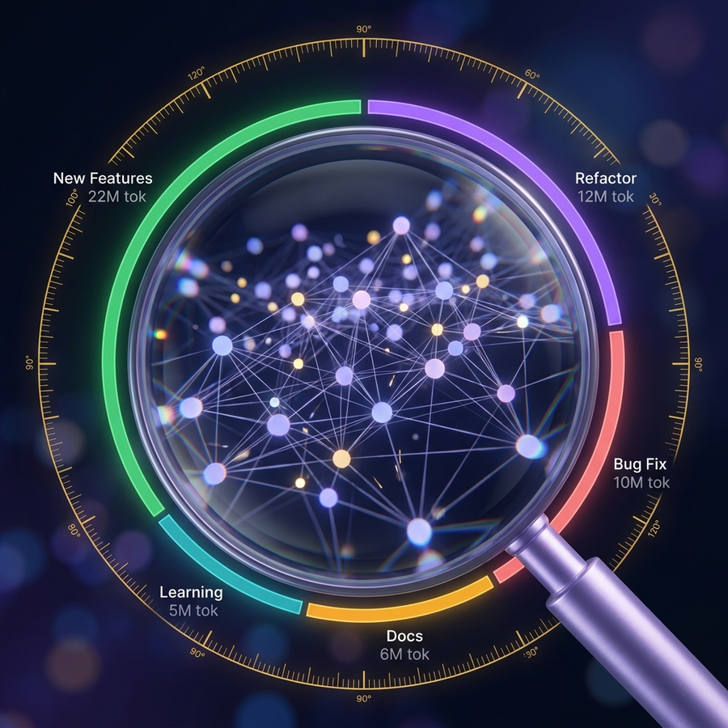
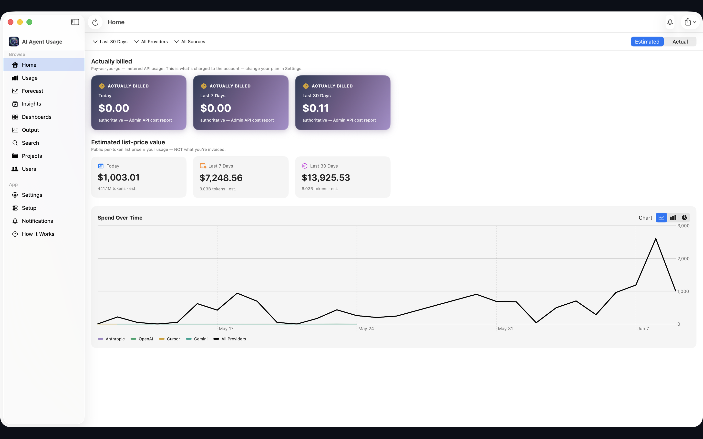
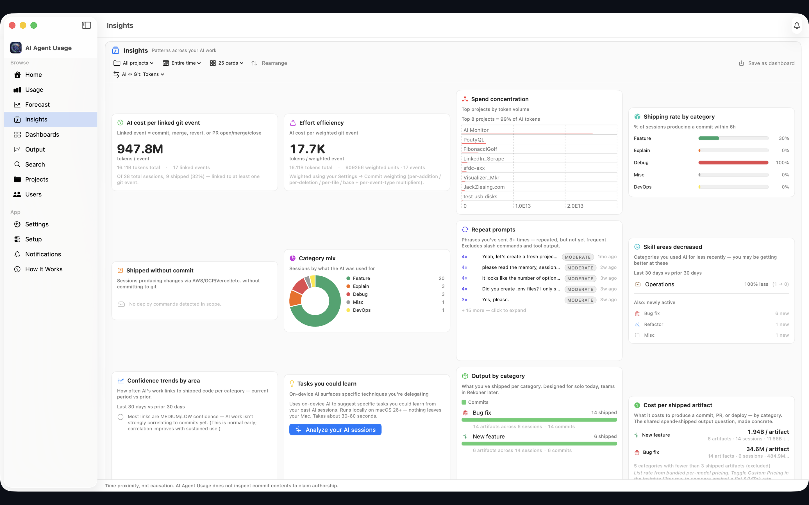
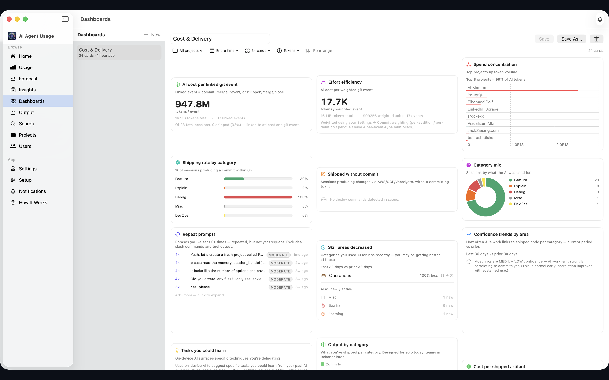
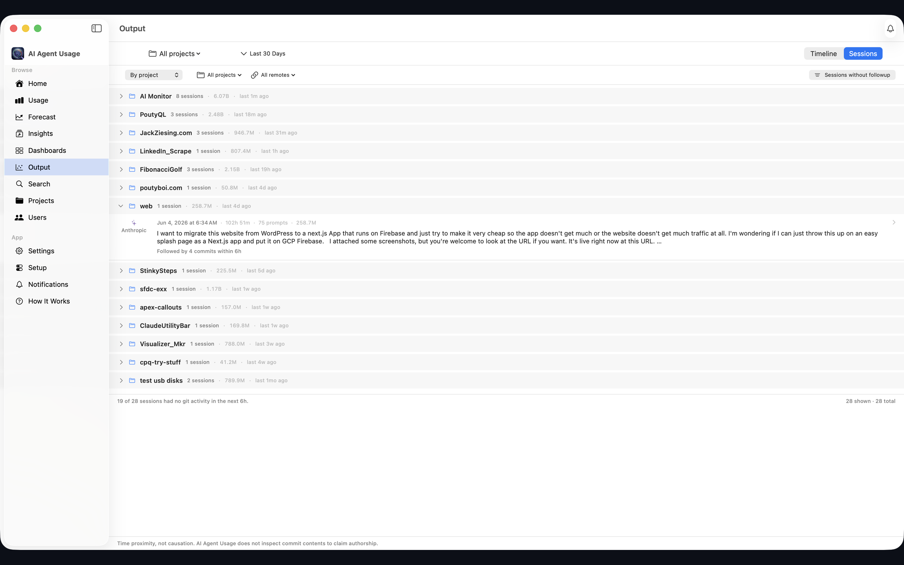
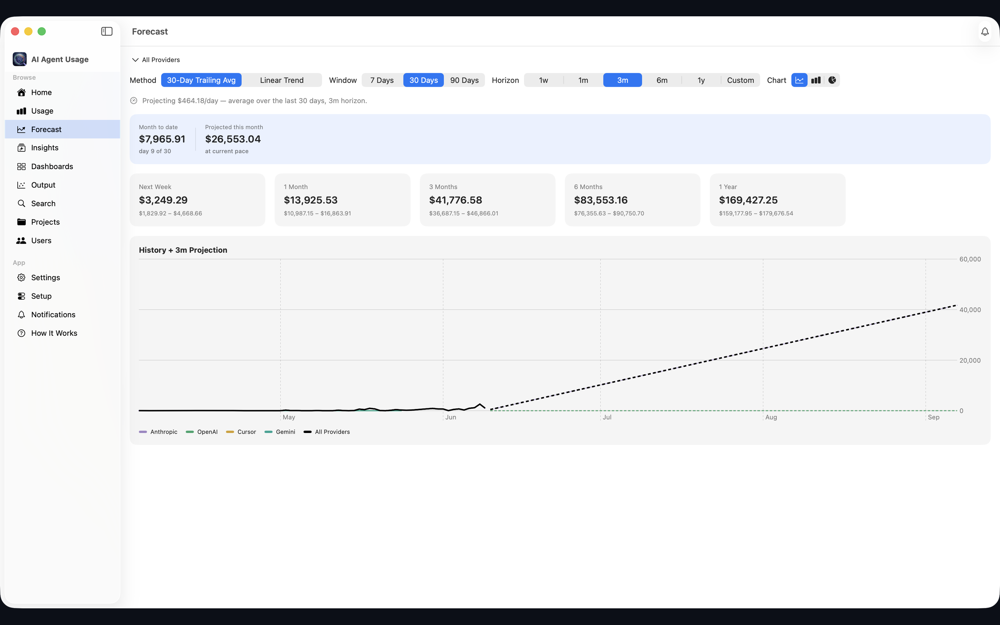
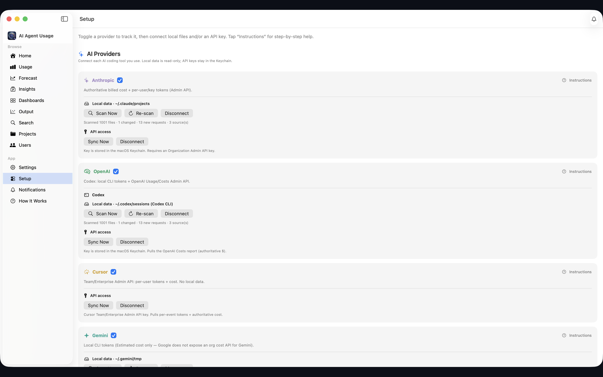

# AI Agent Usage

  

**See, forecast, and break down what your AI coding agents cost — and what they actually ship.**

A native macOS app that reads your local Claude Code, Codex CLI, Cursor, and Gemini CLI session files, turns them into cost + token rollups, and gives you searchable transcripts, ~25 insight cards, and now **custom Dashboards** you can save and revisit.

  <a href="https://github.com/jziesing/ai-agent-usage-downloads/releases/latest/download/AI-Agent-Usage.dmg"><strong>Download the DMG (v1.3.0)</strong></a>
  &nbsp;·&nbsp;
  <a href="https://apps.apple.com/us/app/id6770159263">Get it on the App Store</a>
  &nbsp;·&nbsp;
  <a href="https://github.com/jziesing/ai-agent-usage-downloads/releases">All releases</a>

*Requires macOS 15+. On-device LLM narrative cards (Apple Foundation Models) require macOS 26+.*

---

## Screenshots

---

## What's new in v1.3.0

### Guided first-run

A built-in onboarding walks you from zero to your first insights — connect a tool, grant read-only access, point it at your code folders, and run your first analysis — with optional steps for the menu bar and notifications.

### Streamlined navigation

A cleaner four-tab layout — **Home**, **Usage**, **Insights**, and **Team** — each with focused sub-tabs, plus a top-bar search.

### Notifications, sorted

Setup and status notifications now group into **Unread / Read / All**, with a one-click "mark all read."

### A menu-bar gauge that sticks around

Opt in to keep a compact token/cost gauge in your menu bar even after you close the window — the app keeps running quietly in the background and reopens the full window any time you click in.

### Background mode

Keep AI Agent Usage in your menu bar, optionally open it at login, and turn on an optional daily recap reminder. A menu bar icon is always visible while it's running, and Quit always fully quits.

### Menu bar at a glance

The menu bar popover now shows today's cost, session count, and your top work categories alongside token totals. Pause and resume any time.

### Daily recap & reflection

An optional end-of-day summary of your work with AI — sessions, categories, and cost — plus a one-minute reflection you can jot down. Everything stays on your Mac.

### Morning prompt (opt-in)

One gentle suggestion on your first open of the day, drawn only from your own history. Off until you ask for it; always dismissible.

### Richer categorization

A new **Agent ops** work category, plus capability, integration, and deliverable tags you can drill into in Insights.

### Improved

Energy-friendly background refresh that cooperates with macOS App Nap. Private and on-device as always — your prompts, usage, and reflections never leave your Mac.

*Earlier: v1.2 added custom **Dashboards**, one-click GitHub sync, and a refreshed design.*

---

## What's in the app

### Home + Usage + Forecast

- **Home** — KPI cards (today / 7d / 30d: tokens, estimated $, billed $), a spend-over-time chart, provider and date filters, Estimated ↔ Actual toggle, and CSV export.
- **Usage** — sortable per-model breakdown (input / output / cache-write / cache-read / cost) across all providers. CSV export.
- **Forecast** — projections for next week / 1m / 3m / 6m / 1y with a low/expected/high band, configurable trailing-average or linear-trend method, and a month-to-date pacing view.

### Insights — individual view

Insight cards are driven by your local session files and git history. No cloud, no account.

- **Token Efficiency** — shipped output tokens vs. total spend, broken down by project.
- **Effort Efficiency** — sessions that linked to a commit vs. exploratory sessions, weighted by commit size.
- **Spend Concentration** — which projects or models absorb the most spend.
- **Shipping Rate** — the fraction of your sessions that correspond to something that shipped.
- **Deploy Sessions** — sessions where a deploy command was detected, correlated to commits.
- **Category Mix** — how your sessions break down across coding, debugging, docs, data, and more.
- **Repeat Prompts** — questions you've asked AI two or more times — a nudge toward where self-learning pays off.
- **Skill Areas Decreased** — categories where you're doing less AI-assisted work; a signal you've grown into them.
- **Confidence Trends** — how HIGH / MEDIUM / LOW attribution-confidence sessions shift over time.
- **Tasks You Could Learn** — an on-device LLM summary (macOS 26+) of techniques you're currently delegating, with a Generate button so you decide when inference runs.

### Insights — manager view

- **Output by Category** — what shapes of work the spend is producing, with session count and tokens per category.
- **Cost per Shipped Artifact** — per-feature and per-bug-fix economics, using local + GitHub commit signal to detect what shipped near a session.
- **Session Patterns** — a non-judgmental contrast of focused vs. exploratory sessions.
- **Budget Narrative** — an on-device LLM (macOS 26+) drafts a short, honest justification of AI spend you can copy into a budget review.
- Plus time-of-day heatmaps, file extension breakdowns, tool-shape distribution, active-days trend, project pairs, provider mix, and more.

### Dashboards

Build a named, saved view of any subset of the insight cards, scoped to a project and date range of your choice. Drag to reorder cards. Save, duplicate, and delete. The last dashboard you viewed reopens automatically.

### Output — session list with git context

Every session lists the commits and PRs that happened within 6 hours, tagged with a confidence band (HIGH / MEDIUM / LOW) based on file overlap and timing. Click a session to see the full transcript, the tools and commands it used, and any detected deploy activity.

### Session transcripts + search

- **Full transcripts** — chat-bubble view of every prompt and response, with copy buttons per turn. Tool output is stored under a tiered policy (Bash/WebFetch capped at 8 KB; file Reads skipped because that content is on disk; web searches kept in full) so you keep the substance without bloating disk.
- **Full-text search** — a Search tab backed by SQLite FTS5. Type a past question or a snippet of an answer and jump to the session, with matched text highlighted.

### Team

An on-device team rollup — total sessions and shipped work across everyone's local data, deduplicated across providers. No server, no per-keystroke tracking.

### Setup

Connect data sources from a single screen. Each source has an **Instructions** button that opens in-context help.

| Source | Auth | What it gives |
|---|---|---|
| **Claude Code** (`~/.claude/projects/**/*.jsonl`) | none | Exact tokens + full history. Cost = list-price estimate. |
| **Anthropic Admin API** | Org Admin key (`sk-ant-admin…`) | Authoritative billed cost. |
| **Codex CLI** (`~/.codex/sessions/**/rollout-*.jsonl`) | none | Per-turn token deltas. Cost = list-price estimate. |
| **OpenAI Admin API** | Org Admin key (`sk-admin-…`) | Authoritative org-wide spend. |
| **Cursor Admin API** | Cursor Team/Enterprise Admin key | Per-event tokens + exact charged cents. |
| **Gemini CLI** (`~/.gemini/tmp/**/chats/session-*.jsonl`) | none | Per-turn token counts. Cost = list-price estimate. |
| **Local git** | none (libgit2, in-process) | Commit history, diff stats, file overlap for attribution. |
| **GitHub** | Personal Access Token | PRs, remote commit metadata for attribution. |

---

## How it works

- **Reads what's already on your Mac.** AI Agent Usage tails the local session files your tools already write, using security-scoped folder access you grant once.
- **Stores everything locally in SQLite.** Usage events, git activity, session metadata, transcripts, and the full-text search index all live in one on-device database. Admin API keys and your GitHub token live in the macOS Keychain, never in the database.
- **Surfaces patterns, not metrics for their own sake.** The Insights and Dashboards layers are built around two questions: *as an individual, what is my AI actually doing for me?* and *as a manager, what shape of work are we getting from this spend?* Cards that use the on-device LLM only run when you click Generate.

---

## Privacy

All transcripts, git data, and analytics are stored on your Mac and never leave it. The app only makes network requests when you explicitly connect a provider Admin API, a GitHub token, or a custom pricing-data feed URL — and those requests go directly from your Mac to the service you authorized.

Read the full [Privacy Policy](privacy.html).

---

## Source + releases

The Mac app source lives in a private repo. This downloads repo, the DMG releases, and the pages here are public.

- **Latest release + previous DMGs:** [github.com/jziesing/ai-agent-usage-downloads/releases](https://github.com/jziesing/ai-agent-usage-downloads/releases)
- **Privacy policy:** [privacy.html](privacy.html)
- **App Store listing:** [apps.apple.com/us/app/id6770159263](https://apps.apple.com/us/app/id6770159263)
